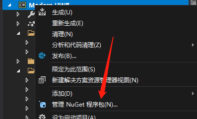
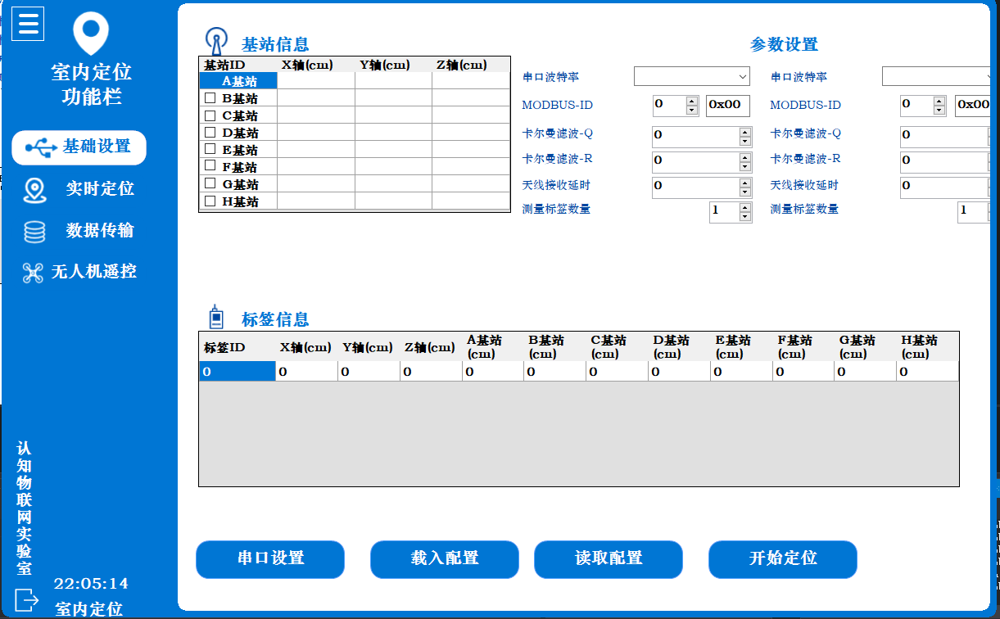
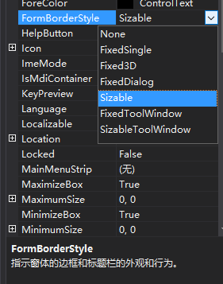
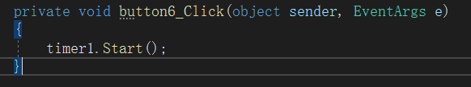
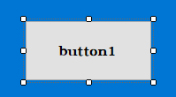
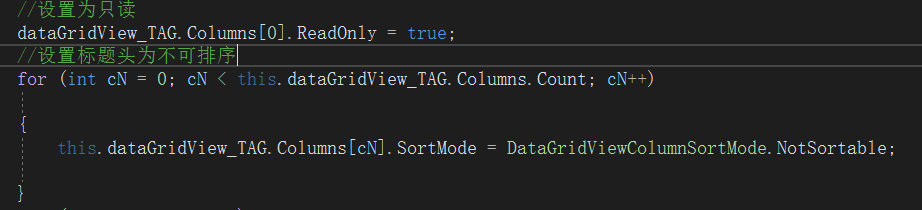

C#现代界面开发设计

## 编译工具

Visual Studio 2019或更高版本，并且需要安装对应的 .NET 框架版本

## 开发控件

VS的C#原生开发控件少，需要添加额外的自定义控件，操作如下：

此工具包为界面设计增添很多帮助

## 参考视频

链接：https://pan.baidu.com/s/1GTzbGyLf43lFNTayn-sUaA 
提取码：xgar 

## 主界面设计

现代流行将主界面大致分成两部分，一部分为功能区，另一部分则是各功能对应窗口。

而在界面开发初期先要定好主界面的窗体，功能按钮则是对应一个个窗体，主函数启动窗口代码如下

该处代码含义则是启动(Form_LeftBar)窗体，如下图

在对窗体内容进行创建时，需要对窗体属性进行设计：

初始窗体是这样的：

显然原生窗体设计过于经典，会显得呆板，因此需要对原窗体进行修改

在窗体的属性中对以下进行调整

AutoScaleMode默认是为font，该作用是让控件自适应分辨率，从而导致在编译界面一个样，运行变成另一个样，效果如下：

Font：

None：

此处则是对窗体的标题框和边框的外观进行修改，此处为Sizeble，具有窗体缩小，放大、关闭等功能，此处调整为None，效果如下：

此处开始进入主窗体的设计：

确定主窗体颜色（此处个性化）

对窗体的尺寸进行修改，规定好程序的启动大小以及启动位置

回到主窗体上，主窗体设计为三部分。（后续UI设计升级并不非得按照此设计）

①：

该部分有三个控件，从左往右分别是button，picturebox，label

button：用来收纳功能栏效果如下：

需要运用timer控件，对timer控件进行编辑，列表按钮在点击事件触发timer，代码如下：

触发该事件会存在拖动变化慢，在此部分代码进行修改可实现移动快慢

picturebox属性如下：

模式选Zoom，则是对原图片进行放大缩小

label属性：

该部分主要是font属性起作用

②：

该部分主要为功能按钮，关闭窗口按钮，以及显示时间

功能按钮：

每个按钮都有各自的click事件，用来启动不同窗体，

放置好按钮，双击按钮编辑click事件

以基础事件按钮点击功能为例：

为了提高代码的可看性以及编辑，该部分需要using其他文件（代码一定要规范，强烈建议每个功能拥有各自的文件CS，切不可全写在一起）

此处new 一个UC_com类的uc

AddControlsToPanel函数则是在部分③中的panel（panelControls）生成对应窗体，效果如下：

每当启动程序，程序会加载窗体

此时初始界面是没有显示功能界面的，因此需要在窗体启动函数的时候加下如下代码，让功能窗体一同生成

显示时间代码：

退出按钮：

在创建窗体的时候，我们将标题栏和边框都取消了，因此需要自己手动设置一个按钮以便退出

③：

主程序窗体设计分为两个panel 左边panel为功能panel，右边panel则是点击按钮后所生成的功能窗口，其中以基础设置的窗体为例：

其中基站信息和标签信息模块所用的控件为:picturebox、label、dataGridView。

## 控件部分

每个控件都拥有独自的属性，也有各自的代码；而原生控件属性模块较少，当遇到原生控件属性无法满足界面需求时，可在XXXXX.Designer.cs文件编辑控件属性代码来达到自己所期望的效果，或是运用市面上开源的自定义控件，如SunnyUi，不仅限于此。

### 按钮

原生按钮功能无法设置圆角边框，观感较差，需要对原函数重新进行修改，这个工程量较大，因此在这一部分是采用自定义控件

市面自定义控件很多，Sunny的自定义控件属性还是会有点欠缺，比如对按钮进行选择时，无法切换按钮中的图片，点击后无法保留被选中的样式，观感较差。

故在源文件加了一点小逻辑，让按钮变得灵活起来

实现效果如下：

### 窗体边框

可以发现初始窗体边框是方的，并不是圆角，需要通过一个自定义控件来实现它，该控件文件名称为ElipseControl.cs

实现方法如下：

在工具栏中找到ElipseControl控件，将其拖动到窗体上

在ElipseControl属性调整CornerRadius的数值实现圆角边框，Target需要选对窗口（每个控件一定要有自己的别名，方便查找）

## 拖动窗体代码

在创建窗体的时候，边框没有，无法拖动程序，在这里通过对panel的拖动来实现程序的拖动

在panel的事件找到mouseDown，添加如下代码实现窗体拖动

此处是①区域的事件，只给这里添加这段函数，是只能在这块区域进行拖动操作，因此为了让其他部分也能有拖动窗体的作用，需要在panel相对应的事件重复上述操作

需要在源文件添加声明

”

        [DllImport("user32.DLL", EntryPoint = "ReleaseCapture")] 
        private extern static void ReleaseCapture();
    
        [DllImport("user32.DLL", EntryPoint = "SendMessage")]
        private extern static void SendMessage(System.IntPtr hWnd, int wMsg, int wParam, int IParam);

“

## 零散代码

以下是部分控件需要添加的代码：

dataGridView：

该代码是让dataGridView只能查看无法点击修改且无法通过表头进行排序（原生控件属性不能设置，需要手动添加上述代码移除）

